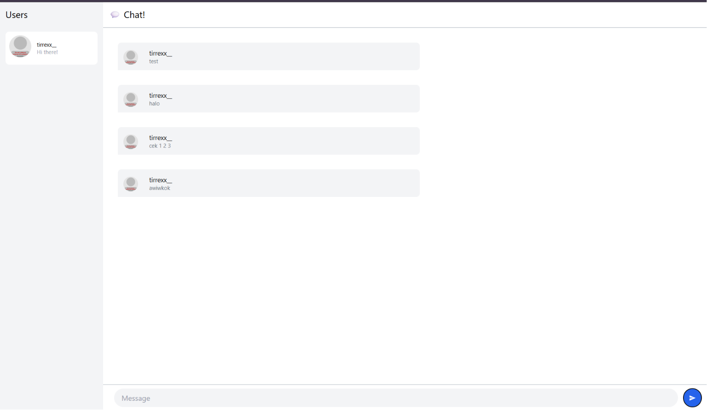
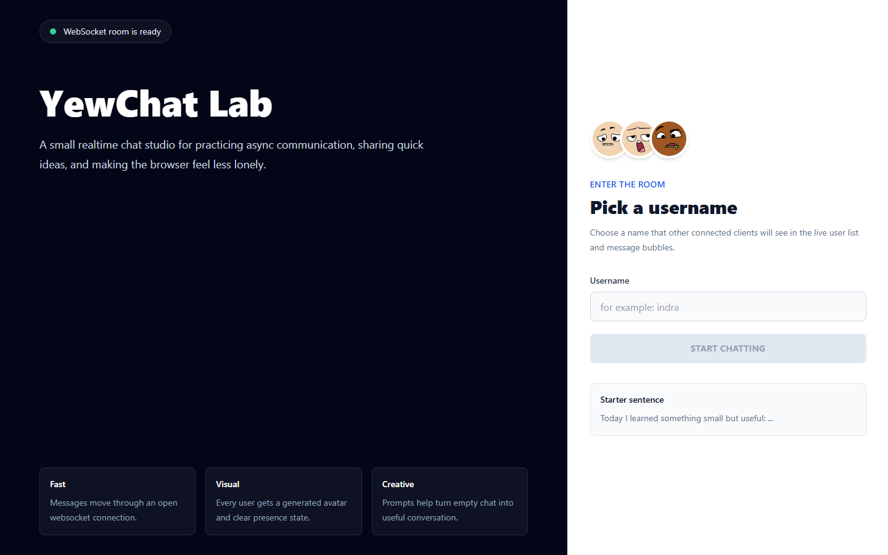

# Tutorial 3: WebChat using Yew

## Overview

This repository contains my implementation of Tutorial 3 from Module 10: Asynchronous Programming. In this tutorial, I explored a realtime web-based chat application built using Rust and Yew. The frontend application communicates with a websocket server so users can send and receive messages instantly through the browser.

The repository consists of two main parts:

- `webclient` → frontend application built with Rust and Yew.
- `server-js` → websocket server used for realtime communication.

This tutorial demonstrates how asynchronous programming can be applied in a modern web application using websocket communication and WebAssembly.

---

# Experiment 3.1: Original code

## Description

In this experiment, I cloned and ran the original YewChat project together with its websocket server. The websocket server handles realtime communication between connected users, while the Yew frontend provides the graphical browser interface for the chat application.

After successfully running both the frontend and backend locally, I tested the application by opening multiple browser tabs and sending messages between users. This experiment demonstrates how asynchronous communication works in a realtime browser application using websockets.

---

## How to run the websocket server

Open a terminal and run:

```bash
cd server-js
npm install
npm start
```

The websocket server will start and listen for incoming websocket connections.

---

## How to run the Yew webclient

Open another terminal and run:

```bash
cd webclient
npm install
npm start
```

After the compilation finishes, open:

```text
http://localhost:8000
```

in the browser.

---

## How to test the application

1. Open the application in two or more browser tabs.
2. Enter different usernames in each tab.
3. Send chat messages between users.
4. Observe how messages appear instantly in all connected clients.

---

## Result




---

## Explanation

The application works using websocket communication between the frontend and the websocket server. Unlike normal HTTP requests that are closed after every response, websocket connections remain open continuously. This allows the server and clients to exchange messages instantly without repeatedly reconnecting.

The frontend application was built using Yew, a Rust framework for building interactive web applications through WebAssembly. The Rust code is compiled into WebAssembly and executed directly inside the browser. This allows Rust to be used not only for backend systems but also for frontend web development.

The websocket server is responsible for managing connected users and broadcasting messages. When one client sends a message, the server forwards the message to every connected client. Because the connection is asynchronous, many users can interact with the chat system simultaneously without blocking the entire application.

Compared to Tutorial 2, which used a terminal-based websocket chat, this tutorial extends the same concept into a graphical web application. This makes the project more realistic because modern chat systems usually operate through graphical browser interfaces rather than terminal applications.

This experiment helped me understand how asynchronous programming, websocket communication, and frontend rendering can work together inside a realtime web application.

---

# Experiment 3.2: Be Creative!

## Description

In this experiment, I redesigned the YewChat webclient into a more expressive realtime chat studio called **YewChat Lab**. The goal was to make the application feel more polished and personal while still keeping the websocket chat functionality from the previous experiment.

I added a creative login lobby, generated avatar previews, clearer onboarding text, and a redesigned chat room interface. The chat room now has an online user sidebar, message counters, a room mood section, creative prompt cards, an empty-state illustration using generated avatars, right-aligned messages for the current user, and Enter-to-send behavior.

---

## Result



---

## Explanation

The creative update focuses on improving both appearance and interaction. The login page now introduces the application as a small realtime chat studio and gives users a clearer reason to enter the room. I also added avatar images so the page feels less empty and more connected to the identity of each chat participant.

Inside the chat page, I changed the layout from a plain chat screen into a studio-like workspace. The left sidebar shows online users and room mood badges, the center area shows the conversation, and the right panel contains creative prompts that can help users start a conversation. These additions make the application more engaging without changing the core websocket protocol.

I also improved the message sending experience. Empty messages are ignored, users can press Enter to send a message, and messages from the current user are visually separated from messages sent by others. This makes the chat easier to scan and closer to a real messaging application.

